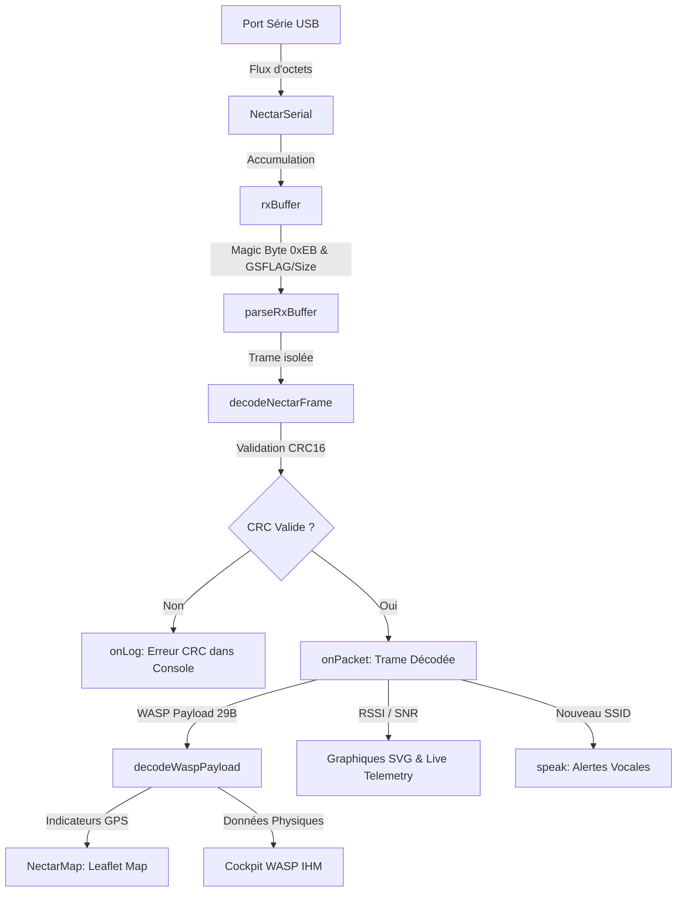
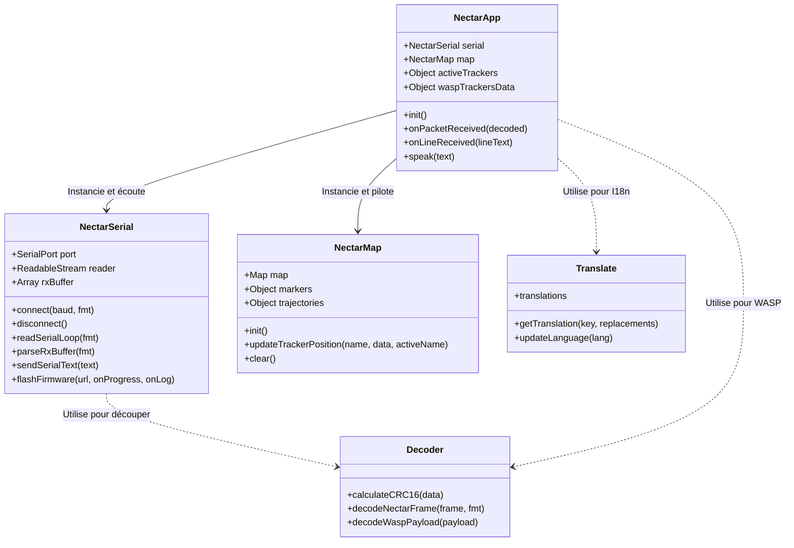

# 📐 Architecture Logicielle - RocketStation Nectar

Ce document détaille l'architecture technique de la console web de la station sol. Il a pour but d'expliquer le fonctionnement de l'application de manière claire, visuelle et structurée, afin qu'un développeur débutant puisse rapidement comprendre les responsabilités de chaque composant.

---

## 🗺️ Flux de Données Événementiel (Interruption)

La station sol fonctionne sur un modèle **événementiel par interruption**. Il n'y a aucun processus de temporisation ou de tampon (Throttling) pour retarder l'affichage. Chaque octet reçu sur le port USB est immédiatement accumulé, analysé et envoyé à l'IHM dès qu'une trame complète est assemblée.

Le schéma ci-dessous décrit le cheminement d'un signal, depuis sa réception physique jusqu'à son rendu visuel et sonore :

---

## 🏛️ Diagramme des Classes et Modules

L'application respecte les principes de la programmation orientée objet (POO) avec une séparation stricte des responsabilités (découplage Vue-Modèle) :

---

## 📋 Tableau des Responsabilités ("Qui fait quoi ?")

| Composant | Fichier | Responsabilité Principale | Fonctions Clés |
| :--- | :--- | :--- | :--- |
| **Orchestrateur** | `app.js` | Point d'entrée, gestion du cycle de vie, liaison des événements du DOM, graphiques SVG temps réel et synthèse vocale. | `init()`, `onPacketReceived()`, `speak()`, `drawSignalCharts()` |
| **Communication** | `serial.js` | Liaison Web Serial, boucle asynchrone matérielle de lecture continue et interfaçage avec `esptool-js` pour le flashage USB de l'ESP32. | `connect()`, `readSerialLoop()`, `parseRxBuffer()`, `flashFirmware()` |
| **Décodeur** | `decoder.js` | Algorithme mathématique CRC16 et parsing binaire pur des paquets de télémétrie. **Zéro dépendance au DOM**. | `calculateCRC16()`, `decodeNectarFrame()`, `decodeWaspPayload()` |
| **Localisation** | `translate.js`| Chargement des dictionnaires FR/EN, scannage et injection dans le DOM, propagation de l'événement custom `lang-changed`. | `updateLanguage()`, `getTranslation()` |
| **Cartographie** | `map.js` | Encapsulation de la bibliothèque Leaflet, placement des marqueurs, animation de pulsation des émetteurs et dessin des lignes de trajectoire. | `init()`, `updateTrackerPosition()`, `clear()` |

---

## ⚡ Résolution du Bug Historique de Saturation
### Le Problème Historique
Lorsqu'un tracker envoyait des trames LoRa à une fréquence élevée, la console web saturait l'Event Loop du navigateur à cause des rafraîchissements graphiques répétés du DOM. L'interface devenait totalement gelée (incapable de traiter les clics ou de déplacer la carte Leaflet).

### La Solution Modulaire Appliquée
1. **Traitement direct par Interruption** : Le script ne fait plus appel à des temporisateurs (Throttling) qui accumulaient de la latence de traitement dans la queue d'événements. Chaque trame est décodée instantanément.
2. **Parser Binaire Conforme à la v1.6.2** : Le micrologiciel récepteur ESP32 a supprimé le caractère de fin de ligne `\n` sur ses trames binaires série USB. Le parser a été mis à jour pour lire exactement `totalFrameSize` octets (sans ajouter l'offset de `+1` de l'ancienne version), éliminant ainsi toute désynchronisation et perte de flux après la première trame.
3. **Isolation Mémoire** : La payload WASP est copiée dans un `ArrayBuffer` dédié avant d'être scannée par un `DataView`, évitant les conflits d'indexation mémoire partagée dans le moteur JavaScript V8.
