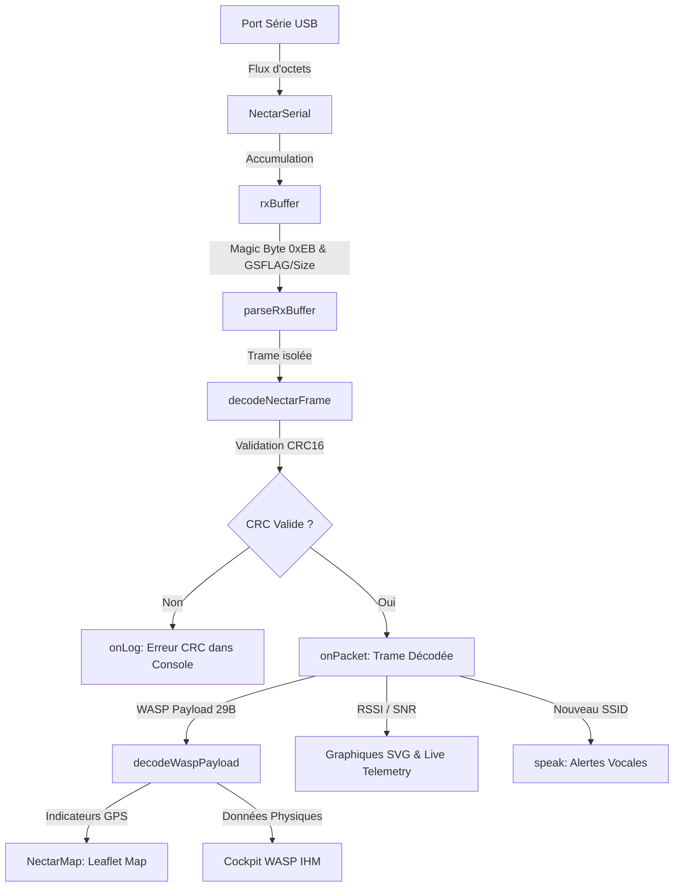
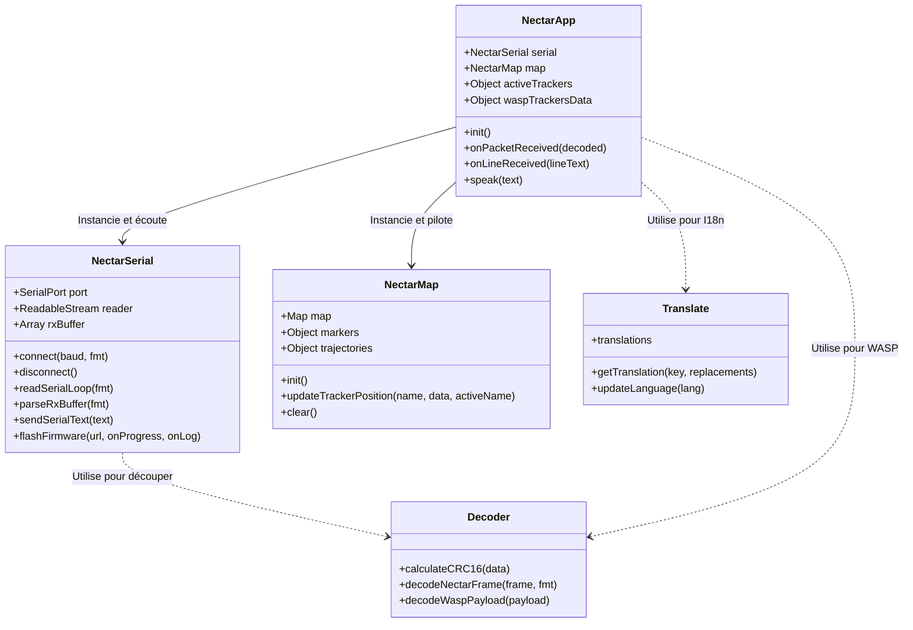

# 📐 Architecture Logicielle - RocketStation Nectar

Ce document détaille l'architecture technique de la console web de la station sol. Il a pour but d'expliquer le fonctionnement de l'application de manière claire, visuelle et structurée, afin qu'un développeur débutant puisse rapidement comprendre les responsabilités de chaque composant.

---

## 🗺️ Flux de Données Événementiel (Interruption)

La station sol fonctionne sur un modèle **événementiel par interruption**. Il n'y a aucun processus de temporisation ou de tampon (Throttling) pour retarder l'affichage. Chaque octet reçu sur le port USB est immédiatement accumulé, analysé et envoyé à l'IHM dès qu'une trame complète est assemblée.

Le schéma ci-dessous décrit le cheminement d'un signal, depuis sa réception physique jusqu'à son rendu visuel et sonore :

---

## 🏛️ Diagramme des Classes et Modules

L'application respecte les principes de la programmation orientée objet (POO) avec une séparation stricte des responsabilités (découplage Vue-Modèle) :

---

## 📋 Tableau des Responsabilités ("Qui fait quoi ?")

| Composant | Fichier | Responsabilité Principale | Fonctions Clés |
| :--- | :--- | :--- | :--- |
| **Orchestrateur** | `app.js` | Point d'entrée, gestion du cycle de vie, liaison des événements du DOM, graphiques SVG temps réel et synthèse vocale. | `init()`, `onPacketReceived()`, `speak()`, `drawSignalCharts()` |
| **Communication** | `serial.js` | Liaison Web Serial, boucle asynchrone matérielle de lecture continue et interfaçage avec `esptool-js` pour le flashage USB de l'ESP32. | `connect()`, `readSerialLoop()`, `parseRxBuffer()`, `flashFirmware()` |
| **Décodeur** | `decoder.js` | Algorithme mathématique CRC16 et parsing binaire pur des paquets de télémétrie. **Zéro dépendance au DOM**. | `calculateCRC16()`, `decodeNectarFrame()`, `decodeWaspPayload()` |
| **Localisation** | `translate.js`| Chargement des dictionnaires FR/EN, scannage et injection dans le DOM, propagation de l'événement custom `lang-changed`. | `updateLanguage()`, `getTranslation()` |
| **Cartographie** | `map.js` | Encapsulation de la bibliothèque Leaflet, placement des marqueurs, animation de pulsation des émetteurs et dessin des lignes de trajectoire. | `init()`, `updateTrackerPosition()`, `clear()` |

## ⚙️ Description Détaillée des Fonctions Clés

### 1. `parseRxBuffer(fwVersionFormat)` — `js/serial.js`
Cette méthode est le coeur du traitement de flux d'entrée. Elle tourne en continu et analyse le tableau d'octets `rxBuffer` :
*   **Identification** : Si l'octet à l'index `0` est `0xEB` (Magic Byte), elle considère qu'il s'agit d'une trame binaire.
*   **Format v1.6.2 (`gs_flag`)** : Elle décode le flag du GS (index 3) et la taille du payload (index 4) pour calculer dynamiquement la taille totale de la trame binaire sans attendre de caractère de fin de ligne `\n`.
*   **Format v1.3.1 (Historique)** : Elle extrait la taille du payload à l'index 3 et inclut le retour chariot `\n` (`+1` octet) dans la taille totale attendue.
*   **Logs de texte** : Si le premier octet n'est pas `0xEB`, elle recherche un caractère de saut de ligne (`\r` ou `\n`) pour découper une ligne de log textuelle brute (provenant des retours de commandes AT, du démarrage de la carte, ou des dumps de la carte SD).

### 2. `decodeNectarFrame(frame, fwVersion)` — `js/decoder.js`
Cette fonction pure effectue les tâches de validation :
*   **CRC16-CCITT** : Elle isole les octets de données, calcule le CRC16 et le compare aux deux derniers octets de la trame. En cas d'erreur de CRC, elle lève une exception et la trame est rejetée.
*   **Décodage des identifiants** : Elle extrait l'ID de la mission (2 octets), qui contient le SSID (type de mission : fusée, mini-fusée ou ballon) et l'APID. Elle renvoie un objet structuré contenant le nom lisible du tracker (ex: `FX3`) et ses métriques radio.

### 3. `decodeWaspPayload(payload)` — `js/decoder.js`
Destinée au décodage de la charge utile de 29 octets du tracker WASP :
*   Elle copie les octets bruts dans un `ArrayBuffer` et instancie un `DataView` pour lire de manière structurée les types binaires : `Float32` pour les coordonnées GPS (latitude, longitude), l'altitude et la vitesse, `Uint32` pour le temps UTC, et des entiers signés/non signés pour la batterie et la température.

### 4. `updateTrackerPosition(trackerName, data, activeTrackerName)` — `js/map.js`
Gère la couche cartographique Leaflet :
*   Elle met à jour ou crée le marqueur géographique sur la carte.
*   Elle maintient et allonge un tracé (polyline) représentant le chemin parcouru par le tracker.
*   Si le tracker mis à jour est celui sélectionné en cockpit (`trackerName === activeTrackerName`), elle applique une classe CSS de pulsation verte sur l'icône Leaflet pour l'identifier visuellement.

### 5. `updateLanguage(lang)` — `js/translate.js`
Assure la localisation de l'interface :
*   Elle parcourt l'ensemble des éléments du DOM disposant d'attributs `data-i18n`, `data-i18n-placeholder` ou `data-i18n-title` pour injecter la traduction correspondante à la langue sélectionnée.
*   Elle émet l'événement `window.dispatchEvent(new CustomEvent('lang-changed'))` afin de forcer l'orchestrateur `NectarApp` à recalculer les textes dynamiques (tels que les indicateurs du cockpit, les graphiques ou le tableau des trackers).
