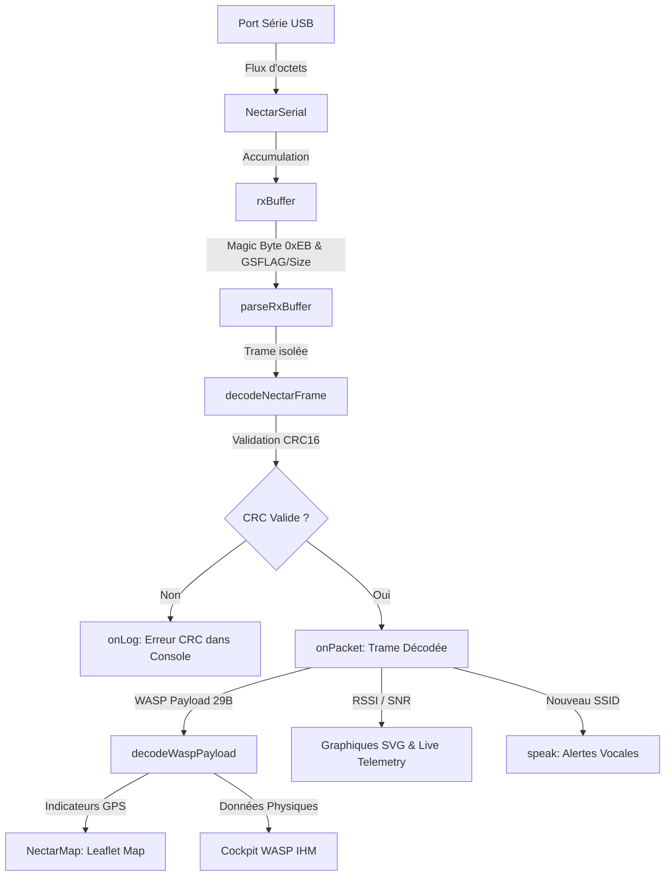
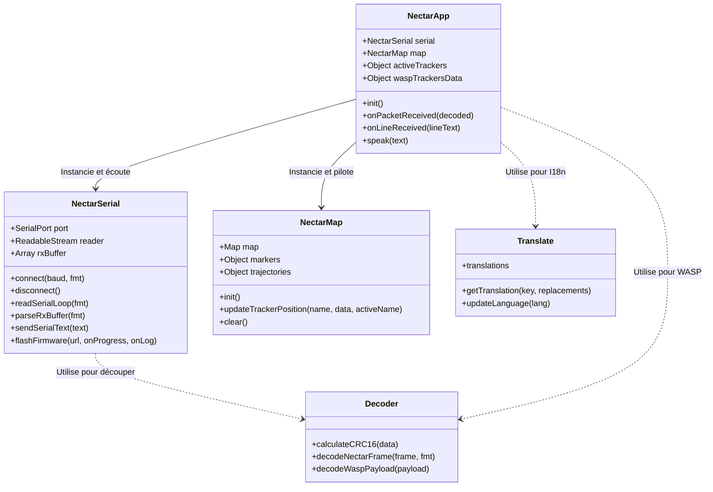

# 📐 Architecture Logicielle - RocketStation Nectar

Ce document détaille l'architecture technique de la console web de la station sol. Il a pour but d'expliquer le fonctionnement de l'application de manière claire, visuelle et structurée, afin qu'un développeur débutant puisse rapidement comprendre les responsabilités de chaque composant.

---

## 🗺️ Flux de Données Événementiel (Interruption)

La station sol fonctionne sur un modèle **événementiel par interruption**. Il n'y a aucun processus de temporisation ou de tampon (Throttling) pour retarder l'affichage. Chaque octet reçu sur le port USB est immédiatement accumulé, analysé et envoyé à l'IHM dès qu'une trame complète est assemblée.

Le schéma ci-dessous décrit le cheminement d'un signal, depuis sa réception physique jusqu'à son rendu visuel et sonore :

---

## 🏛️ Diagramme des Classes et Modules

L'application respecte les principes de la programmation orientée objet (POO) avec une séparation stricte des responsabilités (découplage Vue-Modèle) :

---

## 📋 Tableau des Responsabilités ("Qui fait quoi ?")

| Composant | Fichier | Responsabilité Principale | Fonctions Clés |
| :--- | :--- | :--- | :--- |
| **Orchestrateur** | `app.js` | Point d'entrée, gestion du cycle de vie, liaison des événements du DOM, graphiques SVG temps réel et synthèse vocale. | `init()`, `onPacketReceived()`, `speak()`, `drawSignalCharts()` |
| **Communication** | `serial.js` | Liaison Web Serial, boucle asynchrone matérielle de lecture continue et interfaçage avec `esptool-js` pour le flashage USB de l'ESP32. | `connect()`, `readSerialLoop()`, `parseRxBuffer()`, `flashFirmware()` |
| **Décodeur** | `decoder.js` | Algorithme mathématique CRC16 et parsing binaire pur des paquets de télémétrie. **Zéro dépendance au DOM**. | `calculateCRC16()`, `decodeNectarFrame()`, `decodeWaspPayload()` |
| **Localisation** | `translate.js`| Chargement des dictionnaires FR/EN, scannage et injection dans le DOM, propagation de l'événement custom `lang-changed`. | `updateLanguage()`, `getTranslation()` |
| **Cartographie** | `map.js` | Encapsulation de la bibliothèque Leaflet, placement des marqueurs, animation de pulsation des émetteurs et dessin des lignes de trajectoire. | `init()`, `updateTrackerPosition()`, `clear()` |

---

## ⚡ Résolution du Bug d'Arrêt de Flux après la Première Trame
### Le Problème Réel Constaté
Sur les versions récentes du micrologiciel (à partir de la v1.6.2), la liaison série USB a cessé d'envoyer le caractère de retour à la ligne `\n` (`0x0A`) en fin de trame binaire. Le décodeur JavaScript d'origine attendait un décalage de `+1` octet pour marquer la fin de la trame. Dès la réception de la deuxième trame, le buffer série subissait un décalage de 1 octet, ce qui masquait le premier octet magique `0xEB`, entraînant la perte et la désynchronisation immédiate et définitive de la liaison.

### Le Correctif Appliqué
1. **Parser Binaire Conforme (v1.6.2)** : Le parser a été corrigé dans `serial.js` pour lire la taille exacte de la trame (`totalFrameSize`) sans attendre d'octet supplémentaire de fin de ligne. Les trames suivantes sont désormais alignées et décodées de manière continue sans aucune perte.
2. **Isolation Mémoire WASP** : Pour éviter toute instabilité de lecture dans la structure binaire, la charge utile WASP de 29 octets est isolée dans un `ArrayBuffer` et lue par un `DataView` indépendant.
